# Nestafar Internship Assignment

---

```markdown
This Flutter project demonstrates a realistic single workflow for ordering food from local restaurants, similar to popular food delivery applications.  
The app uses BLoC architecture for state management and follows SOLID principles with mock data and clean UI design — ensuring scalability, readability, and maintainability.


## 🚀 Features

- 🏠 Restaurant List — View a curated list of restaurants using mock data.
- 🍱 Menu Display — Each restaurant shows a list of food items with prices and descriptions.
- 🛒 Cart Management — Add or remove food items and view total cost in real time.
- 💸 Checkout Workflow — Simulate order placement with smooth UX flow.
- ❌ Error Handling — Handles invalid states and edge cases gracefully.
- 🧱 BLoC State Management — Built with the BLoC pattern for predictable and testable state transitions.
- 🧪 Unit Tests Included — Covers core business logic and validation.


## 🧩 Project Structure

- lib/ → Main source folder  
- core/ → Utilities, constants, error handling  
- data/ → Data models and mock data  
- domain/ → Business logic, entities, and use cases  
- presentation/ → UI layer, BLoCs, and widgets  
- test/ → Unit tests for workflows


## 🧠 Architecture

The app follows the Clean Architecture pattern and the BLoC (Business Logic Component) architecture for reactive state management.


UI → Bloc → UseCases → Repository → Model


- UI (presentation layer): Displays data & listens to Bloc state changes.  
- Bloc (business logic): Processes user input and emits states.  
- UseCases (domain layer): Encapsulates business logic.  
- Repository (data layer): Provides mock data (no real API calls).  


## 🧑‍💻 How to Run the App

Follow the steps below to run this project locally.

## 1️⃣ Clone the Repository

```bash
git clone https://github.com/<your-username>/nestafar_assignment.git
cd nestafar_assignment
````

### 2️⃣ Install Dependencies

```bash
flutter pub get
```

### 3️⃣ Run the App

To run on an emulator or physical device:

```bash
flutter run
```

You can also specify a device (e.g., Chrome, Android, iOS):

```bash
flutter run -d chrome
```

---

## 🧪 Running Unit Tests

Run all tests using the following command:

```bash
flutter test
```

The test files are located inside the `/test` directory:

```
test/
├── domain/
│   └── usecases/
│      
└── presentation/
    └── blocs/
```

---

## 🖼️ Screenshots

### 🏠 Home Screens
| Home 1 | Home 2 | Home 3 |
|:--:|:--:|:--:|
| 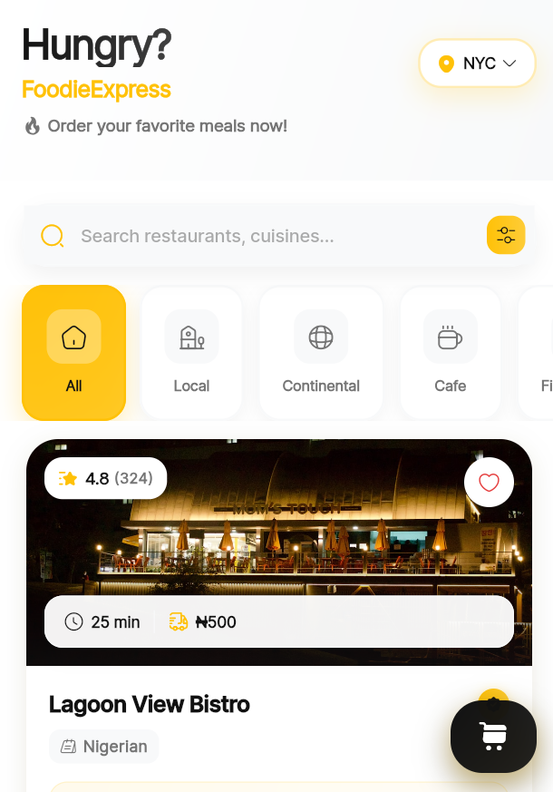 |  | 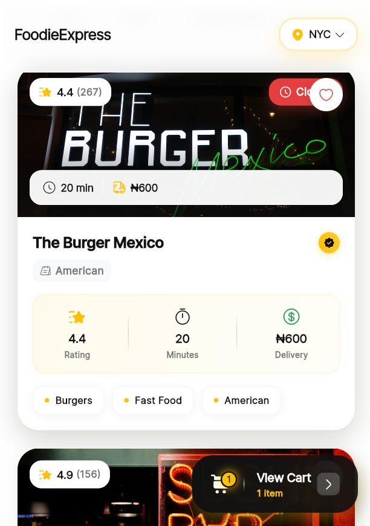 |

---

### 🍽️ Restaurant Detail Screens
| Restaurant Detail 1 | Restaurant Detail 2 |
|:--:|:--:|
|  |  |

---

### 🛒 Cart & Checkout Screens
| Cart | Cart (Alt) | Add to Cart |
|:--:|:--:|:--:|
|  | 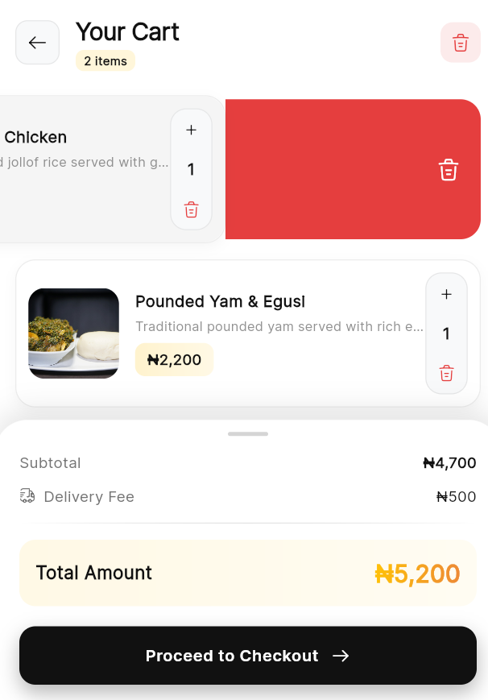 | 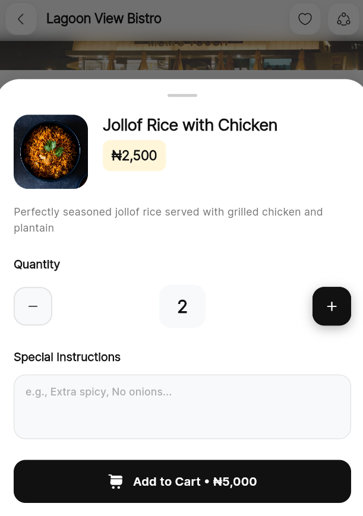 |

| Empty Cart | Empty Checkout | Delete from Cart |
|:--:|:--:|:--:|
| 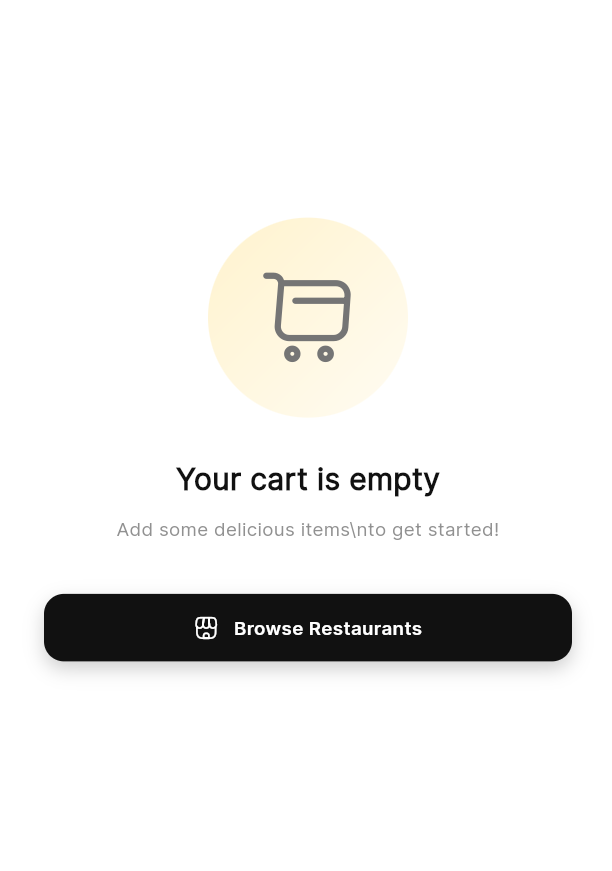 | 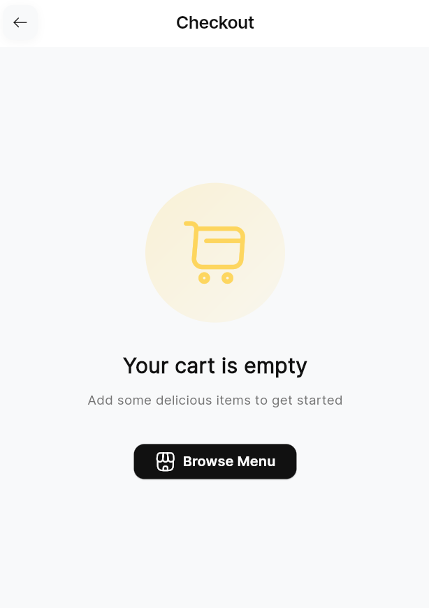 | 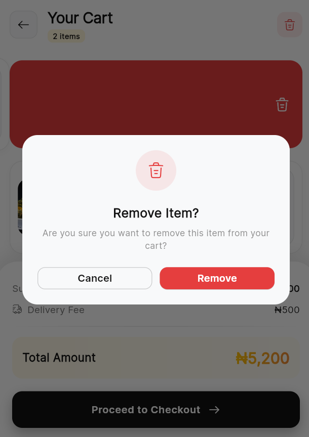 |

---

### 📦 Order Details & Tracking
| Order Details 1 | Order Details 2 | Order Details 3 |
|:--:|:--:|:--:|
| 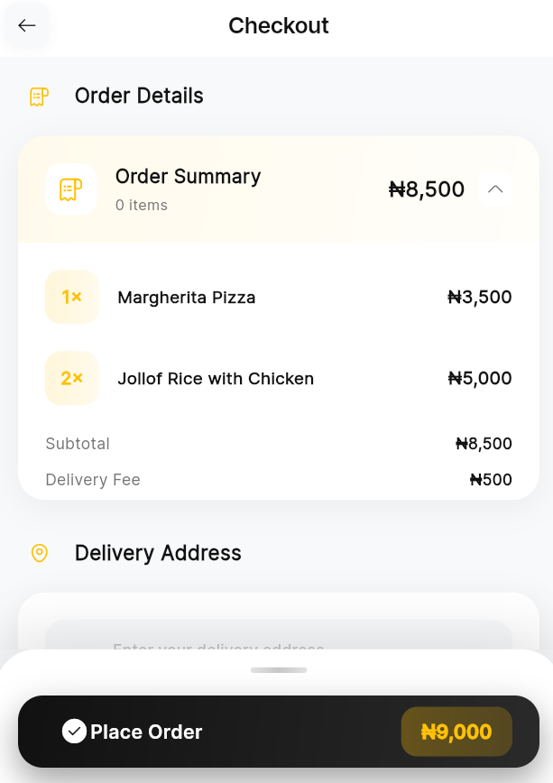 | 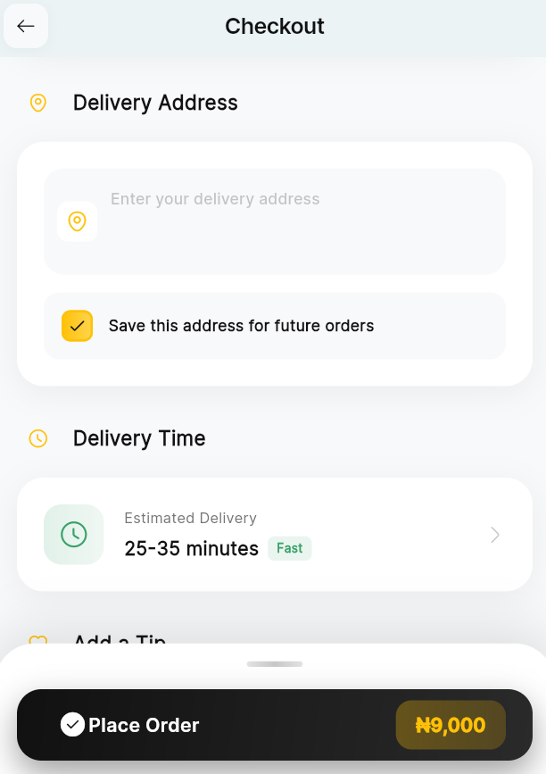 | 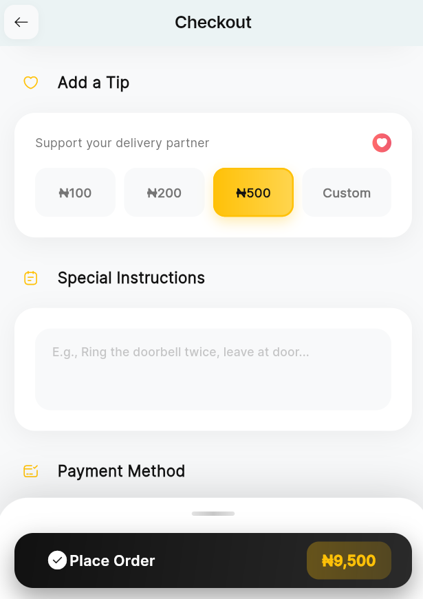 |

| Order Details 4 | Order Placed | Order Loading |
|:--:|:--:|:--:|
| 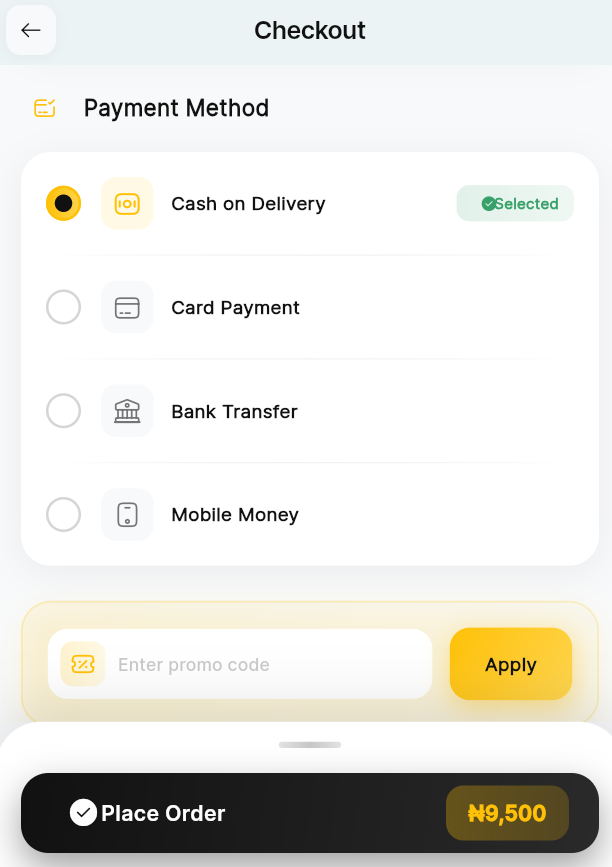 | 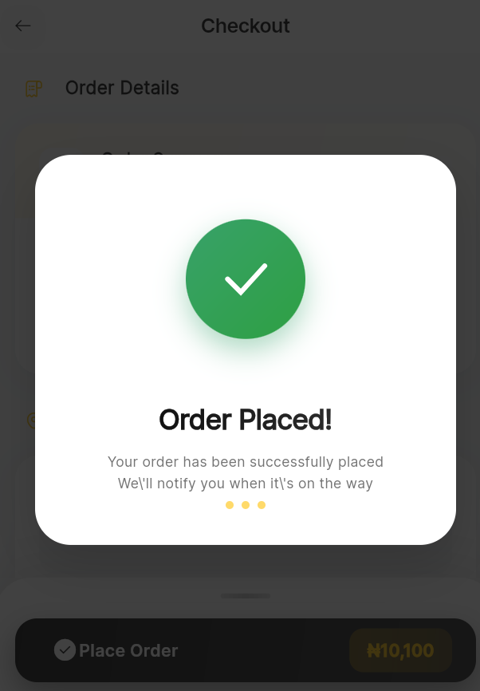 | 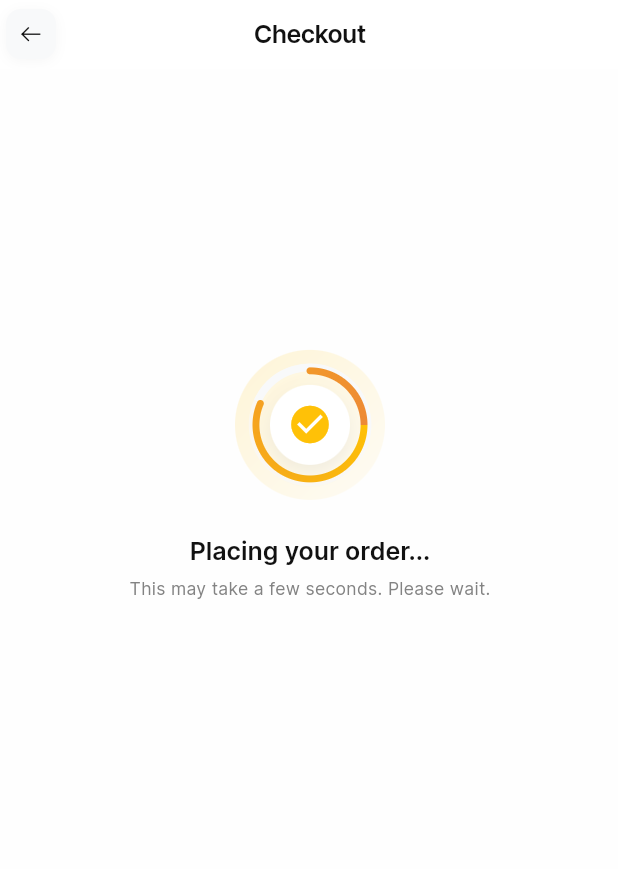 |

---

### 🚚 Order Tracking Screens
| Tracking 1 | Tracking 2 | Tracking 3 |
|:--:|:--:|:--:|
| 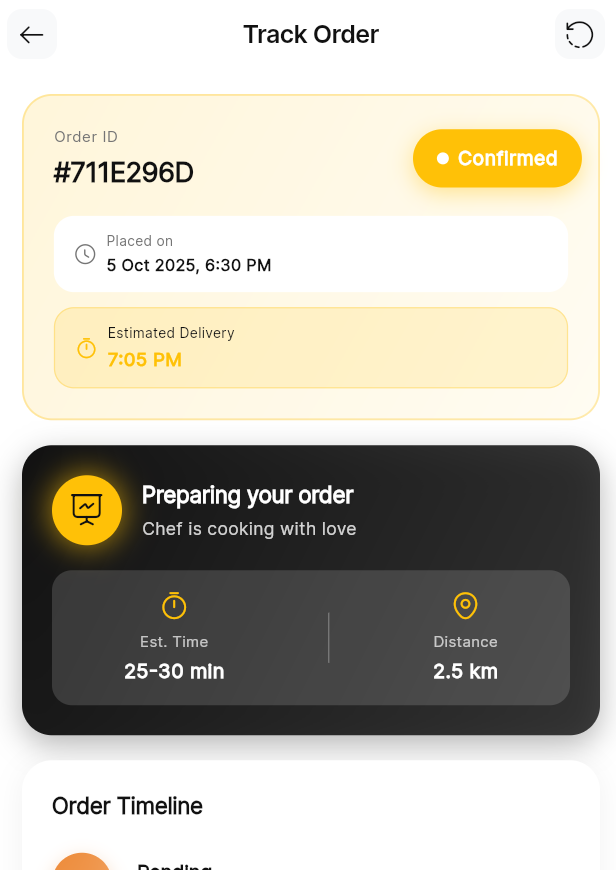 |  | 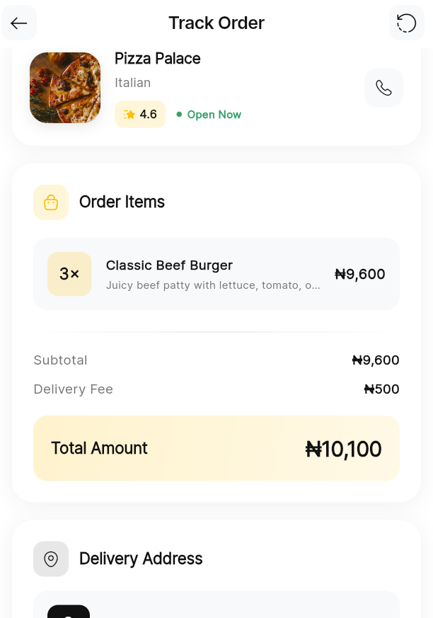 |

---

### ⏳ Loading Screen
| Loading |
|:--:|
| 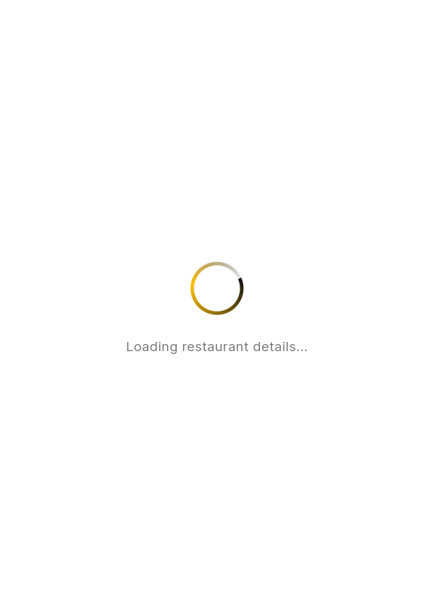 |

---


---

## 💡 Notes

* API integration is not required— mock data is used throughout.
* Designed to mimic the real ordering experience within one workflow.
* Proper error handling is implemented for all major states.
* The UI aims for a clean, minimal, and aesthetically pleasing layout.

---

## 🧑‍🏫 Author

**Ezekiel Daramola**
📧 [daramolaezekiel73@gmail.com]
💬 Built with ❤️ for the Internship


---
Internship Application
